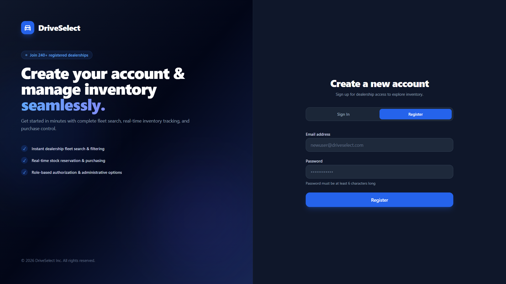
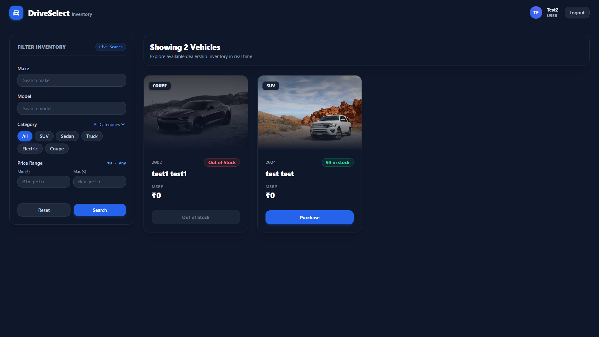
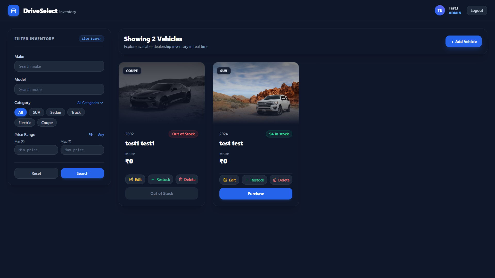
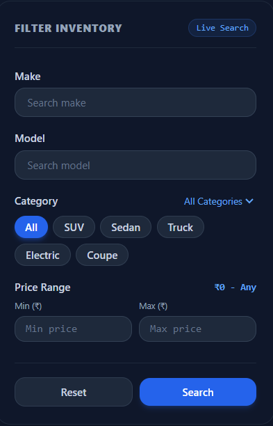
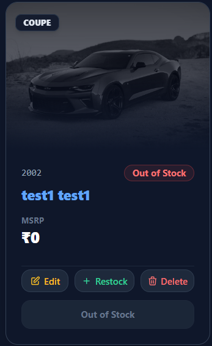

# 🚗 Car Dealership Inventory System

> 🚀 A production-ready full-stack vehicle inventory management system with secure authentication, role-based access control, real-time inventory management, advanced search & filtering, and a modern responsive UI.

Built using **Test-Driven Development (TDD)** with comprehensive backend and frontend testing.

---

## 🚀 Live Demo

🌐 **Application:**  
👉 https://car-dealership-inventory-final.vercel.app
> Replace the link above with your deployed application.

---

## 📚 Table of Contents

- 🚀 Live Demo
- ✨ Features
- 🛠️ Tech Stack
- 📂 Project Structure
- ⚙️ Prerequisites
- 🔐 Environment Variables
- 🚀 Installation
- 📡 API Endpoints
- 🧪 Testing
- 📸 Screenshots
- 🤖 AI Usage
- 📄 License

---

# 🛠️ Tech Stack

<p>
  
  
  
  
</p>

### ⚙️ Backend

- 🟢 Node.js
- 🚂 Express.js
- 🍃 MongoDB
- 📦 Mongoose
- 🔐 JSON Web Tokens (JWT)
- 🔑 bcrypt

### 🎨 Frontend

- ⚛️ React 19
- ⚡ Vite
- 🧭 React Router v7
- 💨 Tailwind CSS
- 🎯 Lucide React

### 🧪 Testing

#### Backend

- ✅ Jest
- ✅ Supertest
- ✅ MongoDB Memory Server

#### Frontend

- ✅ Vitest
- ✅ React Testing Library
- ✅ jsdom
- ✅ @testing-library/jest-dom

---

# ✨ Features

## 🔐 Authentication & Authorization

- ✅ JWT Authentication
- 🔒 Secure Password Hashing (bcrypt)
- 👥 Role-Based Access Control (RBAC)
- 👤 Customer & Admin Roles

---

## 🚗 Vehicle Inventory

- 📋 Browse all vehicles
- 🔎 Advanced multi-field search
- 🏷️ Filter by Make
- 🚘 Filter by Model
- 📂 Filter by Category
- 💰 Filter by Price Range

---

## 👨‍💼 Admin Dashboard

- ➕ Add Vehicles
- ✏️ Update Vehicles
- 🗑️ Delete Vehicles
- 📦 Restock Inventory
- 📊 Manage Stock Levels

---

## 🛒 Customer Features

- 🚙 Purchase Vehicles
- ⚡ Real-Time Inventory Updates
- 📉 Automatic Stock Tracking

---

## 🎨 Modern UI/UX

- 📱 Responsive Design
- 💨 Tailwind CSS
- 🔔 Toast Notifications
- ⏳ Skeleton Loading
- 🪟 Modal Forms

---

# 📂 Project Structure

```text
.
├── backend/
├── frontend/
├── PROMPTS.md
├── README.md
└── LICENSE
```

---

# ⚙️ Prerequisites

Before running the project, make sure you have:

- 🟢 Node.js v18+
- 📦 npm v9+
- 🍃 MongoDB (Local or Atlas)

---

# 🔐 Environment Variables

## Backend (`backend/.env`)

```env
MONGODB_URI=mongodb://localhost:27017/car-dealership

JWT_SECRET=your-super-secret-jwt-key

PORT=5000
```

## Frontend (`frontend/.env`)

```env
VITE_API_URL=http://localhost:5000
```

---

# 🚀 Installation

## 📥 Clone Repository

```bash
git clone <repository-url>

cd car-dealership-inventory-system
```

---

## ⚙️ Backend

```bash
cd backend

npm install

npm run dev
```

Production

```bash
npm start
```

---

## 🎨 Frontend

```bash
cd frontend

npm install

npm run dev
```

Production Build

```bash
npm run build
```

---

# 📡 API Endpoints

## 🔐 Authentication

| Method | Endpoint | Access |
|---------|----------|--------|
| POST | `/api/auth/register` | 🌍 Public |
| POST | `/api/auth/login` | 🌍 Public |
| GET | `/api/auth/me` | 🔒 Authenticated |

---

## 🚗 Vehicles

| Method | Endpoint | Access |
|---------|----------|--------|
| GET | `/api/vehicles` | 🌍 Public |
| GET | `/api/vehicles/search` | 🌍 Public |
| POST | `/api/vehicles` | 👨‍💼 Admin |
| PUT | `/api/vehicles/:id` | 👨‍💼 Admin |
| DELETE | `/api/vehicles/:id` | 👨‍💼 Admin |
| POST | `/api/vehicles/:id/purchase` | 👤 Customer |
| POST | `/api/vehicles/:id/restock` | 👨‍💼 Admin |

---

## ❤️ Health Check

| Method | Endpoint |
|---------|----------|
| GET | `/api/health` |

---

# 🧪 Testing

## 🔙 Backend

```bash
cd backend

npm test

npm run test:coverage
```

### ✅ Results

- 🟢 11 Test Suites Passed
- 🟢 60 Tests Passed
- 📊 92.41% Coverage

---

## 🎨 Frontend

```bash
cd frontend

npm test

npm run test:watch
```

### ✅ Results

- 🟢 16 Test Suites Passed
- 🟢 76 Tests Passed

---

# 📸 Screenshots

### 🔑 Login Page


### 📊 Dashboard Catalog


### 👨‍💼 Admin Management Controls


### 🔍 Multi-Parameter Vehicle Search & Filter


### 🛒 One-Click Purchase & Real-Time Stock Tracking



---

# 🤖 AI Usage

This project was developed with assistance from **Google Gemini AI** for:

- 💡 Brainstorming
- 🐞 Debugging
- 📝 Documentation
- 🧪 Test Development
- ⚙️ Code Improvements
- 🚀 Development Support

📄 **Complete AI prompt history is available in:**

```text
PROMPTS.md
```

Please review **PROMPTS.md** for the full record of AI-assisted development used throughout this project.

---

# 📈 Test Coverage

### Backend

- ✅ 11 Test Suites
- ✅ 60 Tests
- 📊 92.41% Coverage

### Frontend

- ✅ 16 Test Suites
- ✅ 58 Tests Passed

---

# 📄 License

📜 This project is licensed under the **MIT License**.

See the **LICENSE** file for more details.

---

## ⭐ If you found this project helpful...

Give it a ⭐ on GitHub!

Happy Coding! 🚀
